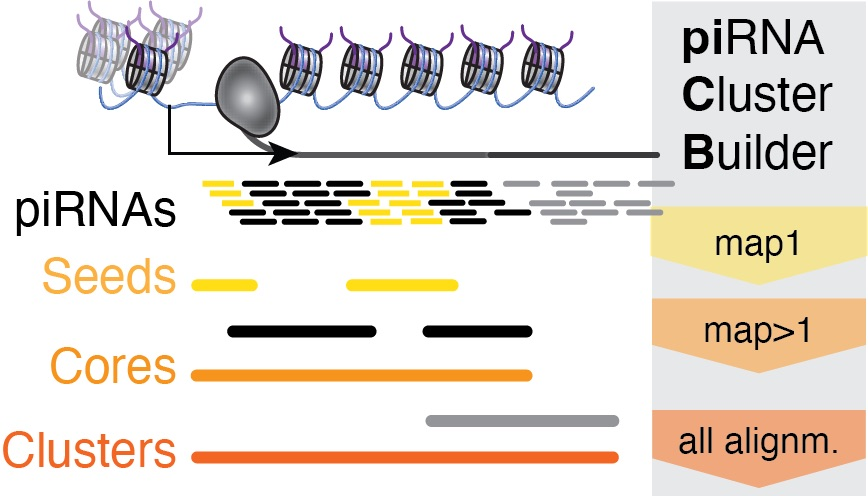

<!-- Style of markdown used from https://github.com/aregtech/areg-sdk --> 
<!-- Recommended live preview: https://markdownlivepreview.com/ --> 
<!-- Logo-->
<h1 align="center" style="display: block; font-size: 2.5em; font-weight: bold; margin-block-start: 1em; margin-block-end: 1em;">

<div align="right">
    <a href="https://www.niddk.nih.gov/research-funding/at-niddk/labs-branches/laboratory-cell-molecular-biology/rna-biology-section">
    
    </a>
</div>

  <br /><br /><strong>piCB - <u>pi</u>RNA <u>C</u>luster <u>B</u>uilder</strong>
</h1>

## Introduction[](#introduction)

**piCB** (*piRNA Cluster Builder*) is a flexible toolkit for assembling, prioritizing, and characterizing piRNA clusters. 

<!--[source to read more](https://). --> 

---

## Table of contents[](#table-of-contents)
- [Motivation](#motivation)
- [Getting started](#getting-started)
- [How to run piCB](#how-to-run-piCB)
    - [Data preparation](#data-preparation)
    - [Running piCB](#running-piCB)
- [Parameter adjustments](#parameter-adjustments)
- [Output](#output)
- [Let's give it a try - An Example](#lets-give-it-a-try---an-example)
- [Authors, Citation and Acknowledgments](#authors-citation-and-acknowledgments)

---

## Motivation[](#motivation)

piRNAs (PIWI-interacting RNAs) and their PIWI protein partners play a key role in fertility and maintaining genome integrity by restricting mobile genetic elements (transposons) in germ cells. PiRNAs originate from genomic regions which are called _piRNA clusters_.

PiCB identifies genomic regions with a high density of piRNAs. This construction of piRNA clusters is performed through stepwise integration of unique and multimapping piRNAs. 

<div align="center"><a href="https://www.sciencedirect.com/science/article/pii/S2211124724011288#sec2"></a></div>

PiCB uses a stepwise integration of unique mapping piRNAs (map1), primary alignments of multimapping piRNAs (map>1), and all possible alignments to build seeds, cores, and clusters. Image and caption taken from <a href="https://www.sciencedirect.com/science/article/pii/S2211124724011288" target="_blank">our publication</a>.

Only very limited programming knowledge is needed to run piCB. Check out our step-by-step instructions and demo. 

Please visit our <a href="https://www.sciencedirect.com/science/article/pii/S2211124724011288" target="_blank">publication</a> for full context.

<div align="right">[ <a href="#table-of-contents">↑ Back to top ↑</a> ]</div>

---

## Getting started[](#getting-started)

piCB runs in R versions <span>&#8805;</span> 4.2. to 4.4.

<!--<p style="color: orange;"> R version?? </p>--> 

It is possible to run piCB in RStudio, in an R script on your local machine or with HPCs (e.g., Biowulf) or in Jupyter Notebook (using R). Keep in mind that as for any handling of large-scale sequencing data you need to have sufficient memory on your device (or cluster) allocated. 

<b>1. Load dependencies in R environment</b>

You will need to install and load the following required R packages:

```R
install.packages("data.table")
install.packages("seqinr")
install.packages("openxlsx")
install.packages("dplyr")
if (!require("BiocManager", quietly = TRUE))
    install.packages("BiocManager")
BiocManager::install("IRanges")
BiocManager::install("GenomicRanges")
BiocManager::install("GenomicAlignments")
BiocManager::install("Rsamtools")
BiocManager::install("Biostrings")
BiocManager::install("GenomeInfoDb")
BiocManager::install("BSgenome")
```
> 💡 In case you have not worked with GRanges yet, we recommend reading the following <a href=https://bioconductor.org/packages/release/bioc/vignettes/GenomicRanges/inst/doc/GenomicRangesIntroduction.html target="_blank">GRanges Introduction</a>.


<b>2. Install piCB</b>

piCB is available to install from any of the following sources:

| Where        | Source   | Command                                                                     |
|-------------|----------|-----------------------------------------------------------------------------|
| Web Browser | GitHub   | <a href="https://github.com/HaaseLab/PICB/archive/refs/heads/main.zip">Download GitHub repository here.</a> Now unzip the file and run `install.packages("Downloads/PICB-main", repos=NULL, type="source")` in R.                |
| R | GitHub   | From GitHub repository: `remotes::install_github("HaaseLab/piCB")`                            |
| Terminal | GitHub   | From GitHub repository: Clone Source Code: `git clone https://github.com/HaaseLab/PICB.git` <!--<br> In R: `install.packages()`--> |
<!--| R     | Bioconductor     | Soon: BiocManager::install("piCB") |
| R | rOpenSci | Soon: `install.packages("piCB", repos = "https://ropensci.r-universe.dev")` |-->
<!-- |Follow steps on image (green button is on top of this page) <br> Or  -->

<!-- Refer to: https://cran.r-project.org/web/packages/githubinstall/vignettes/githubinstall.html --> 

Now load piCB in your R environment: 
```R
library('PICB')
```


From now on it gets even easier. 

---

## How to run piCB[](#how-to-run-piCB)

There are just two required inputs: the **BAM File** and the **Reference Genome**.

### Data preparation
<!--<details open>
<summary> Click to show / hide <i>data preparation</i> </summary>--> 
Checklist for having the right **BAM File**

- [ ] NH and NM tags are included
- [ ] Indexed (.bai file required) 

<details close><summary title="Click to show/hide details"> <u>Click to show/hide solutions to the question: Unsure how the bam-files were mapped?</u></summary><br/>
If you already mapped your sequencing data, but are unsure if these requirements are fulfilled, you can check them by using <a href=https://www.htslib.org/ target="_blank"> samtools</a>. 

```bash
#Test if bam file has NM and NH tags using samtools package
samtools view yourBamFile.bam | head -n 1000 | awk '{if($0 ~ /NM:i:/ && $0 ~ /NH:i:/) print "NM and NH tags found"; else if($0 ~ /NM:i:/) print "Only NM tag found"; else if($0 ~ /NH:i:/) print "Only NH tag found"; else print "Neither NM nor NH tag found"; exit}'
```
If the BAM file has both required tags, the output should be '_NM and NH tags found_'.
```bash
#Test if bam file is coordinate-sorted using samtools package
samtools view -H yourBamFile.bam" | grep '^@HD' | awk -F'\t' '{for(i=1;i<=NF;i++) if($i ~ /^SO:/) print $i}'
```
If the BAM file is coordinate-sorted, the output should be '_SO:coordinate_'. If you don't see any output, or if the SO field has a different value (e.g., SO:queryname for query name sorted or SO:unsorted), then the BAM file is not coordinate-sorted.

<!--I run those with a file that has NH and NM tags, did not run for a file that does not have those tags. -->
</details>

**Three options for providing the _Reference Genome_**


1. Your genome is part of the <a href= https://kasperdanielhansen.github.io/genbioconductor/html/BSgenome.html target="_blank" rel="noopener noreferrer">BSgenome</a> package
  
```R
#example (replace with your genome), previous installation of BSgenome required
mygenome <- "BSgenome.Dmelanogaster.UCSC.dm6"
```

2. Chromosome names and lengths according to the _BAM file_</label>


```R
mygenome <- GenomeInfoDb::Seqinfo(seqnames = c("chr2L", "chr2R", "chr3L", "chr3R", "chr4", "chrX", "chrY"), 
                                seqlengths = c(23513712, 25286936, 28110227, 32079331, 1348131, 23542271, 3667352))
```

3. _Fasta_ with the assembled genome sequence.
```R
mygenome <- PICBloadfasta(FASTA.NAME="/path/to/your/genome.fa")
```


<!--</details>-->

### Running piCB
<!--<details open>
<summary>
    Click to show / hide <i>How to run PICB</i>
</summary>
<br/>-->

1. Load your mapped piRNAs with `PICBload`

```R
myAlignments <- PICBload(bam_directory, mygenome)
```


2. Build piRNA clusters with `PICBbuild`

```R
myClusters <- PICBbuild(myAlignments, REFERENCE.GENOME= mygenome)$clusters
```

> 💡 Both `PICBload` and `PICBbuild` allow wide-ranging adjustments: Read the below section [Parameter adjustments](#parameter-adjustments) to adapt to sparse reference genomes and specific limitations of the data set.

> 💡 As described [here](#motivation), `PICBbuild` integrates unique mapping (seeds), primary multimapping (cores) and secondary alignments stepwise. You can access the outputs of the previous steps by using `$seeds` or `$cores` instead of `$clusters`.

<!--</details>-->

---

### Parameter adjustments[](#parameter-adjustments)


PiCB allows wide-ranging parameter adjustments to adapt to e.g. sparse reference genomes and specific limitations of the data set. Tables of adjustments for both functions are shown below. 

<details close><summary title="Click to show/hide details">Click to show / hide: Parameters for <code>PICBload</code></summary><br/>

Required parameters: 
* BAMFILE
* REFERENCE.GENOME 

<br>

Adjustable parameters:


| Parameter Name | Possible Values | Default Value | Explanation |
|----------------|-----------------|---------------|-------------|
| VERBOSE | TRUE, FALSE  | TRUE | Allows disabling progress messages while running `PICBload`. |
| IS.SECONDARY.ALIGNMENT | TRUE, FALSE, NA | NA  (all alignments) | Determines which alignment types (primary multimappers and secondary multimappers) will be loaded. |
| STANDARD.CONTIGS.ONLY   | TRUE, FALSE  | TRUE        | Determines whether alignments from non-standard contigs are used. |
| FILTER.BY.FLAG   | TRUE, FALSE | TRUE | Allows only those alignments with flag values present in the vector of allowed flags SELECT.FLAG. Default values of SELECT.FLAG are 0, 16, 272 and 256 (primary and secondary alignments on plus and minus strands). If FALSE, includes all flags. |
| USE.SIZE.FILTER   | TRUE, FALSE | TRUE | Allows filtering of alignments based on size. Default value is 18-50 nt. |
| TAGS   | _vector_  | c("NH","NM")  | Indicates list of tags to be extracted from given bam file. The “NH” tag is required to deduce if the alignment is unique mapping or multimapping. The “NM” is required to identify mismatches if required in further analysis. |
| GET.ORIGINAL.SEQUENCE | TRUE, FALSE  | FALSE  | Allows extraction of original read sequence from the bam file. |
| SIMPLE.CIGAR  | TRUE, FALSE  | TRUE  | Allows filtering out spliced alignments. |
| PERFECT.MATCH.ONLY   | TRUE, FALSE  | FALSE  | Allows filtering out alignments with mismatches. |
| WHAT   | _vector_ | c(“flag”)         | Allows importing flags. Corresponds to “what” from ScanBamParam-class [Morgan M, Pagès H, Obenchain V, Hayden N (2023). Rsamtools: Binary alignment (BAM), FASTA, variant call (BCF), and tabix file import]  |


</details>


<details close><summary title="Click to show/hide details">Click to show / hide: Parameters for <code>PICBbuild</code></summary><br/>

Required parameters: 
* IN.ALIGNMENTS (output of `PICBload`)
* REFERENCE.GENOME (reference genome previously used in `PICBload`)

The library size can be adjusted as shown in our [piCB demo](#lets-give-it-a-try---an-example), however in most cases this is not necessary.

| Parameter Name | Possible Values | Default Value | Explanation |
|----------------|-----------------|---------------|-------------|
| LIBRARY.SIZE | _integer_  |  number of unique mapping alignments + number of primary multimapping alignments  | number of reads in the library |
| VERBOSITY | 0,1,2,3  |  2  | Allows choosing the quantity of progress messages while running `PICBbuild`. Depending on VERBOSITY's value, printed messages are missing (0), include current processing step (1), include additionally current processing sub-step (2) or include chosen parameters for `PICBbuild`)|
| COMPUTE.1U.10A.FRACTIONS | TRUE, FALSE  |  FALSE  | Adds fraction of 1U and 10A for each read type (unique, multi.primary, multi.secondary). Requirement: GET.ORIGINAL.SEQUENCE set to TRUE in `PICBload`.|

<br>

PICBbuild integrates unique mapping (seeds), primary multimapping (cores) and secondary alignments stepwise using the sliding window algorithm. Each step allows following parameter adjustments. 

Adjustable parameters for processing **unique mapping alignments**:


| Parameter Name | Possible Values | Default Value | Explanation |
|----------------|-----------------|---------------|-------------|
| UNIQUEMAPPERS.SLIDING.WINDOW.WIDTH | _integer_  | 350 nt   | Sets length of sliding windows for uniquely mapping alignments. |
| UNIQUEMAPPERS.SLIDING.WINDOW.STEP | _integer_  | UNIQUEMAPPERS.SLIDING. WINDOW.WIDTH divided by 10 and rounded to the nearest integer | Sets distance between starts of the windows for uniquely mapping alignments. |
| MIN.UNIQUE.ALIGNMENTS.PER.WINDOW | _integer_ | Value corresponding to 2 FPKM  | Sets coverage threshold for seed discovery. Corresponds to normalized counts of uniquely mapping alignments throughout the window (in FPKM). |
| MIN.UNIQUE.SEQUENCES.PER.WINDOW | _integer_  | 1 per 50 nt of window length or MIN.UNIQUE.ALIGNMENTS.PER.WINDOW whichever is smaller | Minimum number of distinct piRNA sequences within the sliding window. This parameter allows identification of clusters supported by a diverse set of piRNA sequences rather than a high number of reads from one or a few piRNA sequences.  |

The called windows are reduced into **seeds** and further filtered: 

| Parameter Name | Possible Values | Default Value | Explanation |
|----------------|-----------------|---------------|-------------|
| THRESHOLD.SEEDS.GAP  | _integer_  | 0 nt | Removes gaps between seeds if below the given length value. |
| MIN.SEED.LENGTH | _integer_  | 2 * UNIQUEMAPPERS.SLIDING. WINDOW.WIDTH + 100 nt = 800 nt | Removes seeds below a certain length (Default requires an actual piRNA coverage of at least 100 nt: UNIQUEMAPPERS.SLIDING.WINDOW.WIDTH (see above, default: 350 nt) at both the 5’ end and the 3’ end, thus making a 350+350+100=800 nt long seed). |
| MIN.COVERED.SEED.LENGTH   | _integer_ | 0 nt | Allows filtering by minimum number of seed bases covered by unique mapping alignments. |

The next step includes **primary multimapping alignments** using a similar but simplified algorithm. Following parameters can be adjusted:


| Parameter Name | Possible Values | Default Value | Explanation |
|----------------|-----------------|---------------|-------------|
| PRIMARY.MULTIMAPPERS.SLIDING.WINDOW.WIDTH  | _integer_  | 350 nt  | Sets lengths of sliding windows for primary multimapping alignments. |
| PRIMARY.MULTIMAPPERS.SLIDING.WINDOW.STEP  | _integer_ | PRIMARY.MULTIMAPPERS. SLIDING.WINDOW.WIDTH divided by 10 and rounded to the nearest integer | Sets distances between starts of windows for primary multimapping alignments. |
| MIN.PRIMARY.MULTIMAPING.ALIGNMENTS.PER.WINDOW  | _integer_ | Value corresponding to 4 FPKM | Sets coverage threshold for calling primary multimapping alignments windows. Corresponds to normalized counts of primary multimapping alignments throughout the window (in FPKM).|

These resulting windows are being reduced into **cores** and are further filtered:

| Parameter Name | Possible Values | Default Value | Explanation |
|----------------|-----------------|---------------|-------------|
| THRESHOLD.CORES.GAP  | _integer_ | 0 nt  | Removes gaps between cores if below the given length value. |

**Seeds** and **primary multimapping windows** overlapping **seeds** merge into **cores**. Standalone **seeds** are also considered **cores**. **Cores** not overlapping with a **seed** are being filtered out as their transcription cannot be verified.

In the next step **secondary alignments** are processed identically as primary multimapping alignments. This step is dependent on whether `PICBload` loaded the secondary alignments (parameter *IS.SECONDARY.ALIGNMENT*).

| Parameter Name | Possible Values | Default Value | Explanation |
|----------------|-----------------|---------------|-------------|
| SECONDARY.MULTIMAPPERS.SLIDING.WINDOW.WIDTH  | _integer_  | 1000 nt  | Sets lengths of sliding windows for secondary alignments. |
| SECONDARY.MULTIMAPPERS.SLIDING.WINDOW.STEP  | _integer_ | 100 nt | Sets distances between starts of the windows for secondary alignments. |
| MIN.SECONDARY.MULTIMAPING.ALIGNMENTS.PER.WINDOW  | _integer_ | Value corresponding to  0.2 FPKM | Sets coverage threshold for calling secondary alignments windows. Corresponds to normalized counts of secondary alignments throughout the window (in FPKM). |

**Cores** and **secondary alignments** overlapping **cores** merge into **clusters**. Standalone **cores** are also considered **clusters**. piRNA **clusters** were formed and include all alignment information. 

<!-- WHAT ABOUT PARAMETERS FROM PICBannotate? LIBRARY.SIZE AND PROVIDE.NON.NORMALIZED --> 


</details>

---

## Output[](#output)

The output of `PICBbuild` includes **seeds**, **cores** and  **clusters**, each in *GenomicRanges* format. In [Running piCB](#running-piCB), we extracted directly the **clusters** using `$clusters`. Extracting the **seeds** and **cores** can be done similarly using `$seeds` and `$cores`. 

The **clusters** follow *GRanges* convention including the genomic coordinates (seqnames, ranges, and strand) and metacolumns. There are in total 9 metacolumns when running piCB with default parameters:

<details close><summary title="Click to show/hide details">Click to show / hide: Output columns of PICB</summary><br/>


| Output Name | Explanation |
|----------------|-----------------|
| type | Type of cluster with possible values: 'SingleCore', 'ExtendedCore', 'MultiCore' |
| width_in_nt | Width of the seed/core/cluster |
| uniq_reads_FPM | Uniquely mapping piRNA reads aligned to the seed/core/cluster (normalized to the number of all aligned reads) |
| multimapping_reads_primary_alignments_FPM | Number of primary multimapping alignments overlapping to the seed/core/cluster (normalized to the number of all aligned reads) |
| all_reads_primary_alignments_FPM | Number of primary alignments overlapping the seed/core/cluster (normalized to the number of all aligned reads) |
| uniq_reads_FPKM | Number of unique reads normalized to the number of all aligned reads and to the size of the corresponding seed/core/cluster length (unique reads FPM per kilobase) |
| multimapping_reads_primary_alignments_FPKM | Number of multimapping reads normalized to the number of all aligned reads and to the size of the corresponding seed/core/cluster length (primary alignments of multimapping reads FPM per kilobase) |
| all_reads_primary_alignments_FPKM | Number of all reads primary alignments normalized to the number of all aligned reads and to the size of the corresponding seed/core/cluster length (primary alignments of all reads FPM per kilobase) |
| fraction_of_width_covered_by_unique_alignments | Fraction of seed/core/cluster length coreved by at least 1 unique mapping piRNA read |

<!-- 
| uniq_reads | Number of uniquely mapping piRNA reads aligned to the seed/core/cluster |
| uniq_reads_FPM | Uniquely mapping piRNA reads aligned to the seed/core/cluster (normalized to the number of all aligned reads) |
| multimapping_reads_primary_alignments_FPM | Primary multimapping alignments overlapping the seed/core/cluster (normalized to the number of all aligned reads) |
| all_reads_primary_alignments_FPM | All primary alignments overlapping the seed/core/cluster (normalized to the number of all aligned reads)|
| width_covered_by_unique_alignments | Number of base pairs of seed/core/cluster length coreved by at least 1 unique mapping piRNA read | 
| uniq_sequences | Number of different unique mapping piRNA sequences aligned to the seed/core/cluster |-->


</details>
<div align="right">[ <a href="#table-of-contents">↑ Back to top ↑</a> ]</div>

---


## Let's give it a try - An Example[](#lets-give-it-a-try---an-example)

In the following, we would like to show you how easy it is to run PICB!

We created a demo to show you the most basic workflow with PICB. You can download mapped reads and experience the workflow in this demo. 


<b>Step 1: Getting started with piCB </b>
* piCB-Tutorial 1/3: Installation of piCB 
<!-- 
Installation of all 3 (or 4) possible installation techniques. Load PICB. Load dependencies.
-->

Follow the steps in [Getting started](#getting-started) to install piCB. You can copy and paste the dependencies directly into your IDE (<u>i</u>ntegrated <u>d</u>evelopment <u>e</u>nvironment, e.g. RStudio or Jupyter Notebook with R). Do not forget to load piCB with `library(PICB)`

<b>Step 2: Data preparation </b>
* piCB-Tutorial 2/3: Preparation of input
<!-- 
Download of example bam file to test run PICB. If you feel extra brave today, feel free to direcly use your own bam file. Skip to section * of this video. Terminal check if NH and NM tag is present if coord. sorted. If you know for sure then no need to check, proceed to next video. *Reference Genome: BSGenome, Load fasta, Coordinates
-->

We showed different ways on how to load your genome. In the following the variant with using the  <a href= https://kasperdanielhansen.github.io/genbioconductor/html/BSgenome.html target="_blank" rel="noopener noreferrer">BSgenome</a> package. You will need to install your specific genome first. In our demo it is the <i>Drosophila melanogaster</i> genome. 

```R
library("BSgenome.Dmelanogaster.UCSC.dm6")
installed.genomes(splitNameParts=FALSE)
#if you see your genome (here: BSgenome.Dmelanogaster.UCSC.dm6) listed, you are all set
```
Now, let's store the genome into the variable `mygenome`.

```R
mygenome <- "BSgenome.Dmelanogaster.UCSC.dm6"
```

<b>Step 3: Running piCB</b>
* piCB-Tutorial 3/3: Running PICBload and PICBbuild
<!-- 
Check for any warning of PICBload, PICBbuild. This code directly for clusters, if you want core and seeds w/o brackets. Wide ranging adjustments vs. e.g. genomes of low quality. Note to ranking: Dependent on what you want to investigate... uniq_reads_FPM
-->

Load the alignments with `PICBload`.
```R
myAlignments <- PICBload("Downloads/PICB-main/demo/Fly_Ov1_chr2L_20To21mb.bam", REFERENCE.GENOME = mygenome)
```
Next, we want to form the piRNA clusters using the `PICBbuild` function. Usually you would not need to include the size of the library (`LIBRARY.SIZE`) since PICB calculates it automatically. However, just for this demo, please include this parameter to adjust to the subset we chose to create this demo. 

```R
myClusters <- PICBbuild(myAlignments, REFERENCE.GENOME = mygenome, LIBRARY.SIZE = 12799826)$clusters
```

Possibilities of verifying the resulting piRNA clusters are described in the [paper](). We note that ranking piRNA clusters is essential for proper interpretation. 

> 💡 Keep in mind that you just run a demo. These are not representative clusters! Though you can apply these steps to your organism of choice and sequencing data. Have fun with piCB and your piRNA clusters!

---


## Authors, Citation and Acknowledgments[](#authors-citation-and-acknowledgments)

Special thanks to all contributors and supporters that starred this repository.

**Our authors:**:

<a href="https://github.com/alexfriman"></a>
<a href="https://github.com/frahrend"></a>

**Our piCB-team:**

<a href="https://github.com/thenoulav"></a>
<a href="https://github.com/LoubalovaZ"></a>
<a href="https://github.com/frahrend"></a>
<a href="https://github.com/alexfriman"></a>
<a href="https://www.niddk.nih.gov/about-niddk/staff-directory/biography/haase-astrid"></a><br>
Visit the lab website of 
<a href="https://www.niddk.nih.gov/about-niddk/staff-directory/biography/haase-astrid">Astrid D. Haase, M.D., Ph.D.</a>

**Our Co-authors and support:**

<a href="https://www.linkedin.com/in/miguel-vasconcelos-almeida-bb93b6140/?originalSubdomain=uk"></a>
<a href="https://github.com/PouletAxel"></a>
<a href="https://www.img.cas.cz/group/petr-svoboda/"></a>
<a href="https://github.com/yuejun-j-wang"></a>
<a href="https://umdphysics.umd.edu/people/faculty/current/item/318-wlosert.html"></a>
<a href="https://www.niddk.nih.gov/about-niddk/staff-directory/biography/lorenzi-hernan"></a>
<a href="https://www.img.cas.cz/group/petr-svoboda/"></a>
<a href="https://www.gen.cam.ac.uk/directory/eric-miska"></a>
<a href="https://mcdb.yale.edu/people/josien-van-wolfswinkel"></a>

<br>

**How to cite piCB**

<i>Citation</i>
<br><br>

This project is licensed under the CC0.1.0 license - see the [LICENSE](/LICENSE.md) file for details.

<!--
Do you like this project? Please join us or [give a ⭐](/stargazers). Let us make piRNA clusters more comparable and easy to build!<br/>
-->
<div align="right">[ <a href="#table-of-contents">↑ Back to top ↑</a> ]</div>

---
<!--


**Share** the project link with your network on social media.

<a href="https://www.linkedin.com/sharing/share-offsite/?url=github.com/HaaseLab/PICB" target="_blank"></a>&nbsp;
<a href="https://twitter.com/intent/tweet?text=Check%20out%20%23PICB%20-%20The%20new%20piRNA%20Cluster%20Builder%20%0A%0Ahttps%3A//github.com/HaaseLab/PICB" target="_blank"></a>&nbsp;
<a href="https://www.facebook.com/sharer/sharer.php?u=https%3A//github.com/HaaseLab/PICB" target="_blank"></a>&nbsp;
<a href="https://t.me/share/url?text=Check%20out%20this%20new%20piRNA%20Cluster%20Builder%20-%20PICB&url=https%3A%2F%2Fgithub.com/HaaseLab/PICB" target="_blank"></a>&nbsp;
<a href="https://wa.me/?text=Check%20out%20this%20new%20piRNA%20Cluster%20Builder%20-%20PICB%5Cn%20https%3A%2F%2Fgithub.com/HaaseLab/PICB" target="_blank"></a>&nbsp;
<a href="mailto:?subject=piRNA%20Cluster%20Builder&body=Check%20out%20this%20new%20piRNA%20Cluster%20Builder%20-%20PICB%20%3A%0Ahttps%3A//github.com/HaaseLab/PICB%0A" target="_blank"></a>
-->

### List of papers utilizing PICB:

- [A comparative roadmap of PIWI-interacting RNAs across seven species reveals insights into de novo piRNA-precursor formation in mammals](https://www.sciencedirect.com/science/article/pii/S2211124724011288) by Parthena Konstantinidou*, Zuzana Loubalova*, Franziska Ahrend*, Aleksandr Friman*, Miguel Vasconcelos Almeida, Axel Poulet, Filip Horvat, Yuejun Wang, Wolfgang Losert, Hernan Lorenzi, Petr Svoboda, Eric A. Miska, Josien C. van Wolfswinkel, Astrid D. Haase*.
- [Dynamic co-evolution of transposable elements and the piRNA pathway in African cichlid fishes](https://www.biorxiv.org/content/10.1101/2024.04.01.587621v1) by Miguel Vasconcelos Almeida*, Moritz Blumer, Chengwei Ulrika Yuan, Pío Sierra, Jonathan L. Price, Fu Xiang Quah, Aleksandr Friman, Alexandra Dallaire, Grégoire Vernaz, Audrey L. K. Putman, Alan M. Smith, Domino A. Joyce, Falk Butter, Astrid D. Haase, Richard Durbin, M. Emília Santos, Eric A. Miska*.

<b> 

<div align="right">[ <a href="#table-of-contents">↑ Back to top ↑</a> ]</div>

<br> <br><br>

<br><br>
<br><br>
<!-- markdownlint-enable -->