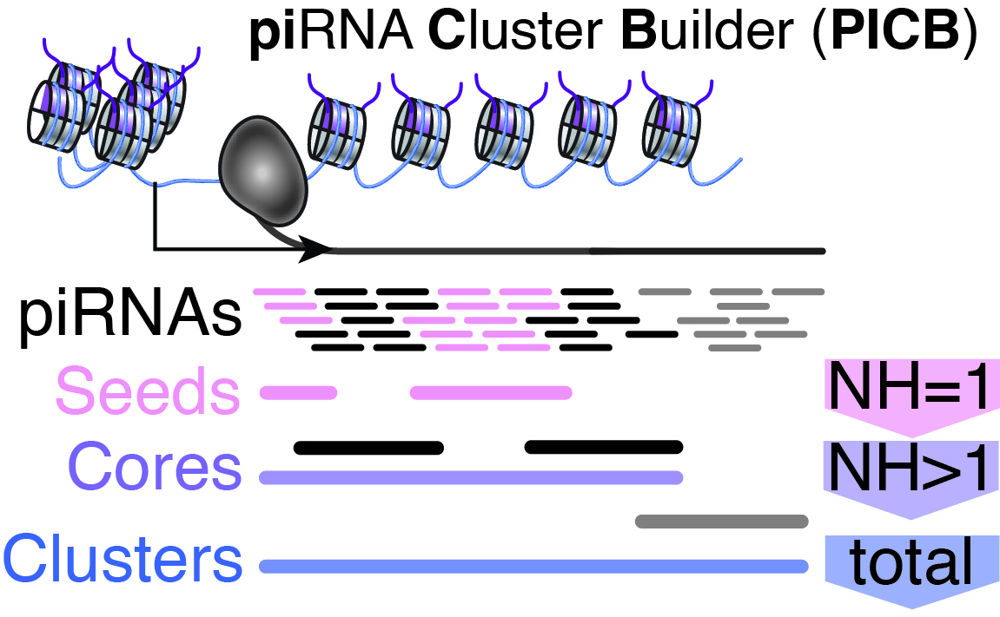

```{r, include = FALSE}
knitr::opts_chunk$set(
    collapse = TRUE,
    comment = "#>"
)
```
# Introduction
PICB is a flexible toolkit for assembling, prioritizing, and characterizing piRNA clusters. piRNAs (PIWI-interacting RNAs) and their PIWI protein partners play a key role in fertility and maintaining genome integrity by restricting mobile genetic elements (transposons) in germ cells. piRNAs originate from genomic regions called _piRNA clusters_. 

PICB identifies genomic regions with a high density of piRNAs through stepwise integration of unique and multimapping piRNAs. 



Figure 1: PICB considers unique mapping piRNAs (NH=1), primary alignments of multimapping piRNAs (NH>1), and all possible alignments stepwise to build seeds, cores, and clusters. Find additional information in our recent [publication](https://www.sciencedirect.com/science/article/pii/S2211124724011288).

Only very limited programming knowledge is needed to run PICB. Check out the following instructions and demonstration. 

# Getting Started

It is possible to run PICB in RStudio, in an R script on your local machine or with High Performance Computing (HPC) resources or in Jupyter Notebook (using R). Keep in mind that as for any handling of large-scale sequencing data you need to have sufficient memory on your device (or cluster) allocated. 

`PICB` requires the CRAN packages `r CRANpkg("data.table")`, `r CRANpkg("seqinr")`, `r CRANpkg("openxlsx")`, `r CRANpkg("dplyr")`, 
and the Bioconductor packages `r Biocpkg("IRanges")`, `r Biocpkg("GenomicRanges")`, `r Biocpkg("GenomicAlignments")`, `r Biocpkg("Rsamtools")`, `r Biocpkg("Biostrings")`, `r Biocpkg("GenomeInfoDb")`, `r Biocpkg("BSgenome")` and `r Biocpkg("rtracklayer")` installed. 

Load PICB in your R environment:


```{r install_dependencies, eval = FALSE}
install.packages(c(
    "data.table",
    "seqinr",
    "openxlsx",
    "dplyr"
))
if (!require("BiocManager", quietly = TRUE)) {
  install.packages("BiocManager")
}
BiocManager::install(c(
    "IRanges",
    "GenomicRanges",
    "GenomicAlignments",
    "Rsamtools",
    "Biostrings",
    "GenomeInfoDb",
    "BSgenome",
    "rtracklayer"
))
```

Next, install PICB from Bioconductor:

```{r install_PICB, eval = FALSE}
BiocManager::install("PICB")
```

Or install the latest development version from GitHub. Note that this version may be less stable than the Bioconductor release. Make sure to have `r CRANpkg("devtools")` installed.

```{r install_PICB_dev, eval = FALSE}
devtools::install_github("HaaseLab/PICB")
```

Then load PICB in your R environment:
```{r load_PICB}
library(PICB)
```

## How to run PICB

PICB requires only two main inputs: a **BAM file** containing the piRNA alignments and the **reference genome**.

### BAM File Requirements

- **piRNA dataset**: Verify your system! piRNAs (short for PIWI-interacting RNAs) are defined by their association with PIWI proteins. Verify the **expression of PIWI proteins** before looking for piRNAs. If possible, work with **‘bona-fide’ piRNAs** that are prepared from purified PIWI-piRNA complexes [Girard et al., 2006](https://doi.org/10.1038/nature04917). Unrelated RNA fragments can be easily mistaken for ‘piRNAs’ in small RNA sequencing data. 
- **NH and NM tags**: The BAM file must include these tags. PICB stops when these tags are not included and provides a descriptive error message.
- **Coordinate-sorted and indexed**: Ensure that your BAM file is sorted and accompanied by a .bai index file. PICB's dependency, GenomicAlignments, stops if the index file is not found and provides a descriptive error message.


### Information on the demo dataset

In the following example, we demonstrate the basic workflow of PICB using a sample dataset.

For this demonstration, we utilize a subset of our mapped small RNAs from Drosophila ovaries [SRR7346241](https://www.ncbi.nlm.nih.gov/sra/?term=SRR7346241). In short, we trimmed the 3’ adaptor and filtered for reads ≥24 nucleotides. 
Next, we removed abundant cellular RNAs (rRNAs, tRNAs, snRNAs, snoRNAs) by annotation. Finally, we mapped the processed reads to the Dm6 genome using STAR ([Dobin et al., 2013](https://doi.org/10.1093/bioinformatics/bts635)) allowing up to one mismatch and 100 alignments per read. 
Using samtools ([Li et al., 2009](https://doi.org/10.1093/bioinformatics/btp352)), we extracted alignments from chr2L:20000000-21000000. 
To further reduce the file size, we retained only the essential tags for PICB (NH, NM) in the BAM file, replaced the sequence quality field (QUAL) with a placeholder (*) and downsampled the file to retain 22% of the reads. 
Lastly, we applied a high level of compression to further reduce its size and indexed the compressed and sorted BAM file. More information on the processing steps can be found in the inst/script folder.

The purpose of this entire reduction process was to significantly minimize the file size, making it manageable for storage. 
It is important to note that this downsampling, combined with the prior restriction to a smaller genomic region (chr2L:20000000-21000000), 
has drastically reduced the coverage and scope of the data, rendering it no longer representative of a biologically relevant sample.


### Reference Genome

You can provide the reference genome to PICB in one of four ways. Make sure to use the same reference genome version as used for mapping.

a. **Using a BSgenome package**

If your genome is available in a BSgenome package, load it directly:

```{r load_BSgenome1, results="hide", message=FALSE}
# Example for Drosophila melanogaster (make sure to install the package first), replace with your own genome
library(BSgenome.Dmelanogaster.UCSC.dm6)
myGenome <- "BSgenome.Dmelanogaster.UCSC.dm6"
```


b. **Using chromosome names and lengths**

If you have the chromosome names and lengths, create a `Seqinfo` object:
```{r load_myGenome2}
myGenome <- GenomeInfoDb::Seqinfo(
    seqnames = c("chr2L", "chr2R", "chr3L", "chr3R", "chr4", "chrX", "chrY"),
    seqlengths = c(23513712, 25286936, 28110227, 32079331, 1348131, 23542271, 3667352)
)
```


c. **Using a Seqinfo object**

Or use an existing `Seqinfo` object:

```{r load_myGenome3}
myGenome <- GenomeInfoDb::Seqinfo(genome = "dm6")
```

d. **Using a FASTA file**

If you have a FASTA file of the assembled genome sequence:

```{r load_myGenome4, eval = FALSE}
myGenome <- PICBloadfasta(FASTA.NAME = "/path/to/your/genome.fa")
```

# Running PICB

PICB involves two main functions:

1. `PICBload`: Loads the piRNA alignments from the BAM file.
2. `PICBbuild`: Builds the piRNA clusters from the loaded alignments.

Next to these two main functions, PICB also includes a function to optimize parameters for `PICBbuild` (`PICBoptimize`) and a function to perform strand-specific analysis (`PICBstrandanalysis`).

## Load Alignments with `PICBload`

Load the sample BAM file provided with the package or provide your own BAM file path.

```{r load_alignments}
# demonstration bam_file is in the "inst/extdata/" folder of the PICB package
bam_file <- system.file("extdata", "Fly_Ov1_chr2L_20To21mb_filtered.bam", package = "PICB")
myAlignments <- PICBload(
    BAMFILE = bam_file,
    REFERENCE.GENOME = myGenome
)
```

The output is a list with three `GenomicRanges` objects:

- `myAlignments$unique`: Unique mapping piRNAs (read mapped only to a single location on the reference genome)
- `myAlignments$multi.primary`: Primary multimapping piRNAs (read mapped to multiple locations on the reference genome, one alignment is assigned as primary by the alignment software based on the mapping quality score. If multiple alignments have the same mapping quality score, the primary alignment is selected randomly.)
- `myAlignments$multi.secondary`: Secondary multimapping piRNAs (read mapped to multiple locations on the reference genome, all other alignments are secondary)

## Build piRNA Clusters with `PICBbuild`

Next, we want to construct the piRNA clusters using the `PICBbuild` function. Usually you would not need to include the size of the library (`LIBRARY.SIZE`) since PICB calculates it automatically. However, just for this demo, please include this parameter to adjust to the subset we chose to create this demo. 

```{r build_clusters}
myClusters <- PICBbuild(
    IN.ALIGNMENTS = myAlignments,
    REFERENCE.GENOME = myGenome,
    LIBRARY.SIZE = 12799826 #usually not necessary
)$clusters
```

We note that ranking piRNA clusters is essential for proper interpretation. PICB provides various [output columns](#output) as options to rank the clusters.

💡 Both `PICBload` and `PICBbuild` allow parameter adjustments. Refer to chapter [Parameter Adjustments](#parameter-adjustments) for insights into customization options. [PICBoptimize](#optimize-parameters) can help you find the optimal parameters for your dataset.


## Optimize parameters with `PICBoptimize`

You can use `PICBoptimize` to find the optimal parameters for `PICBbuild` for your dataset.
This is especially useful if you are not sure about the quality of your data or your reference genome.
The goal is to find a set of parameters that maximize the number of piRNAs accomodated in the clusters while minimizing genomic space occupied by the clusters. 

Make sure to provide the values for the parameters as a vector. An example is shown below:

```{r optimize_parameters}
parameterExploration <- PICBoptimize(
    IN.ALIGNMENTS = myAlignments,
    REFERENCE.GENOME = myGenome,
    MIN.UNIQUE.ALIGNMENTS.PER.WINDOW = c(1, 2, 3, 4, 5), 
    LIBRARY.SIZE = 12799826, #usually not necessary
    VERBOSITY = 1
)
```

This function works on numerical parameters (see list of parameters in [Parameter Adjustments](#parameter-adjustments)) and returns a dataframe with any combination of your chosen parameters and their corresponding number of clusters, the total width of the clusters in nucleotides, the number of reads explained by the clusters, the mean RPKM of the clusters, the fraction of reads explained by the clusters and the fraction of genomic space occupied by the clusters.

Be aware that for most datasets, the default parameters will yield great results and you do not need to optimize parameters. 

As an example, we can plot the results to find the optimal parameters for your dataset. First specify the parameter you want to optimize.

```{r example_specify_parameter}
x_column <- "MIN.UNIQUE.ALIGNMENTS.PER.WINDOW" # change parameter to optimize, if applicable
```

Then plot the results.

```{r example_plot_optimize_parameters, message=FALSE}
library(ggplot2)
# Determine a scaling factor for the secondary axis
scaling_factor <- max(parameterExploration$fraction.of.library.explained.by.clusters) / max(parameterExploration$clusters.fraction.of.genome.space)
# plot graph
ggplot(parameterExploration, aes(x = .data[[x_column]])) +
    geom_line(aes(y = fraction.of.library.explained.by.clusters * 100, color = "piRNAs Explained"), linewidth = 1) +
    geom_point(aes(y = fraction.of.library.explained.by.clusters * 100, color = "piRNAs Explained"), size = 3) +
    geom_line(aes(y = clusters.fraction.of.genome.space * scaling_factor * 100, color = "Genome Space"), linewidth = 1) +
    geom_point(aes(y = clusters.fraction.of.genome.space * scaling_factor * 100, color = "Genome Space"), size = 3) +
    scale_y_continuous(name = "piRNAs Explained by Clusters (%, piRNA sample)", sec.axis = sec_axis(~ . / scaling_factor, name = "Total piRNA cluster-length (Genome, %)")) +
    scale_x_reverse(name = paste0("Parameter chosen: ", x_column), breaks = parameterExploration[[x_column]], labels = parameterExploration[[x_column]]) +
    scale_color_manual(name = "Metrics", values = c("piRNAs Explained" = "#00a100", "Genome Space" = "black")) +
    theme_classic() +
    theme(axis.title.y.left = element_text(color = "#00a100"), axis.title.y.right = element_text(color = "black"), legend.position = "top")
```

As described earlier, we subset the dataset to include only reads from chromosome 2L and further downsampled the file to retain 22% of the reads for this demonstration.
This is why the proportion of reads explained by clusters and the genome space occupied by the clusters is so low, as shown in the plot. The plot can help you identify the optimal parameters for your dataset.
However, for this demonstration, optimization is neither necessary nor meaningful.
Refer to the [paper](https://www.sciencedirect.com/science/article/pii/S2211124724011288) for more information on how to interpret the results. 
In most cases, the default parameters yield excellent results (high piRNA coverage and low genome space occupation), so parameter optimization is usually unnecessary. 


## Strand-specific analysis with `PICBstrandanalysis`

Next to the core-PICB analysis, `PICBstrandanalysis` allows for strand-specific analysis of piRNA clusters. This computes the sense/antisense ratio of piRNAs per cluster (non-collapsed) and adds this information as a new metadata column (`s_as_ratio`). 

```{r strand_specific_analysis}
myClustersWithStrandAnalysis <- PICBstrandanalysis(
    IN.ALIGNMENTS = myAlignments,
    IN.RANGES = myClusters
)
```

To visualize the sense/antisense ratio of the clusters, you can plot the sense/antisense ratio of the clusters in a violin plot. Higher numbers indicate a higher ratio of sense to antisense piRNAs, while values close to 1 indicate an equal ratio of sense and antisense piRNAs.

In [Explore Results](#explore-results) you can see that the sense/antisense ratio is added as a new metadata column (`s_as_ratio`) and is quite low. 
This indicates that the demonstration example is dealing with dual-stranded piRNA clusters.

## Explore Results

Inspect the piRNA clusters:

```{r output_clusters}
myClustersWithStrandAnalysis
```

Explainations of the output columns are listed under the chapter [Output](#output).

## Export Results

You can export the results to an excel file using `PICBexporttoexcel`.

```{r export_results}
PICBexporttoexcel(
    IN.RANGES = myClustersWithStrandAnalysis,
    EXCEL.FILE.NAME = "myClusters_demonstration.xlsx"
)
```

When exporting clusters only (PICBbuildOutput$clusters), you receive an excel file with just one sheet containing the clusters. 
When you export all resulting list items of `PICBbuild` (PICBbuildOutput with all 3 elements: seeds, cores and clusters), you receive an excel file with three sheets containing the seeds, cores and clusters. 


## Import Results

When needed, you can import the results from an excel file using `PICBimportfromexcel`.

```{r import_results}
myClustersWithStrandAnalysis <- PICBimportfromexcel(EXCEL.FILE.NAME = "myClusters_demonstration.xlsx")
```


> 💡 Keep in mind that you just run a demo. These are not representative clusters! Though you can apply these steps to your organism of choice and sequencing data. 


# Parameter Adjustments

As previously mentioned, PICB allows wide-ranging parameter adjustments to adapt to e.g. sparse reference genomes and specific limitations of the data set. Lists of possible parameter adjustments for `PICBload` and `PICBbuild` are shown below. 

## Parameters for `PICBload`

Required parameters: 

- **BAMFILE**
- **REFERENCE.GENOME** 

Optional parameters:

- **VERBOSE** default TRUE • Allows disabling progress messages while running `PICBload`.
- **IS.SECONDARY.ALIGNMENT** default NA (all alignments) • Determines which alignment types (primary multimappers and secondary multimappers) will be loaded.
- **STANDARD.CONTIGS.ONLY** default TRUE • Determines whether alignments from non-standard contigs are used.
- **FILTER.BY.FLAG** default TRUE • Allows only those alignments with flag values present in the vector of allowed flags SELECT.FLAG. Default values of SELECT.FLAG are 0, 16, 272 and 256 (primary and secondary alignments on plus and minus strands). If FALSE, includes all flags.
- **USE.SIZE.FILTER** default TRUE • Allows filtering of alignments based on size. Default value is 18-50 nt.
- **TAGS** default c("NH","NM") • Indicates list of tags to be extracted from given bam file. The “NH” tag is required to deduce if the alignment is unique mapping or multimapping. The “NM” is required to identify mismatches if required in further analysis.
- **GET.ORIGINAL.SEQUENCE** default FALSE • Allows extraction of original read sequence from the bam file.
- **SIMPLE.CIGAR** default TRUE • Allows filtering out spliced alignments.
- **PERFECT.MATCH.ONLY** default FALSE • Allows filtering out alignments with mismatches.
- **WHAT** default c("flag") • Allows importing flags. Corresponds to “what” from ScanBamParam-class `r Biocpkg("Rsamtools")`.


## Parameters for `PICBbuild`

Required parameters: 

- **IN.ALIGNMENTS** (output of `PICBload`)
- **REFERENCE.GENOME** (reference genome previously used in `PICBload`)

The library size can be adjusted as shown in our [PICB demo](#example-workflow), however in most cases this is not necessary.

- **LIBRARY.SIZE**: default number of unique mapping alignments + number of primary multimapping alignments • number of reads in the library.
- **VERBOSITY** default 2 • Allows choosing the quantity of progress messages while running `PICBbuild`. Depending on VERBOSITY's value, printed messages are missing (0), include current processing step (1), include additionally current processing sub-step (2) or include chosen parameters for `PICBbuild`.
- **COMPUTE.1U.10A.FRACTIONS** default FALSE • Calculates the fractions of piRNAs with a 1U (Uridine at the 5' most piRNA position) and a 10A (adenine at position 10). Requirement: GET.ORIGINAL.SEQUENCE set to TRUE in `PICBload`.

PICBbuild integrates unique mapping (seeds), primary multimapping (cores) and secondary alignments stepwise using the sliding window algorithm. Each step allows following parameter adjustments. 

Adjustable parameters for processing **unique mapping alignments**:

- **UNIQUEMAPPERS.SLIDING.WINDOW.WIDTH**  default 350 nt • Sets length of sliding windows for uniquely mapping alignments.
- **UNIQUEMAPPERS.SLIDING.WINDOW.STEP** default UNIQUEMAPPERS.SLIDING. WINDOW.WIDTH divided by 10 and rounded to the nearest integer • Sets distance between starts of the windows for uniquely mapping alignments.
- **MIN.UNIQUE.ALIGNMENTS.PER.WINDOW** default Value corresponding to 2 FPKM • Sets coverage threshold for seed discovery. Corresponds to normalized counts of uniquely mapping alignments throughout the window (in FPKM).
- **MIN.UNIQUE.SEQUENCES.PER.WINDOW** default 1 per 50 nt of window length or MIN.UNIQUE.ALIGNMENTS.PER.WINDOW whichever is smaller • Minimum number of distinct piRNA sequences within the sliding window. This parameter allows identification of clusters supported by a diverse set of piRNA sequences rather than a high number of reads from one or a few piRNA sequences. 

The called windows are reduced into **seeds** and further filtered: 

- **THRESHOLD.SEEDS.GAP** default 0 nt • Removes gaps between seeds if below the given length value.
- **MIN.SEED.LENGTH** default 2 * UNIQUEMAPPERS.SLIDING. WINDOW.WIDTH + 100 nt = 800 nt • Removes seeds below a certain length (Default requires an actual piRNA coverage of at least 100 nt: UNIQUEMAPPERS.SLIDING.WINDOW.WIDTH (see above, default: 350 nt) at both the 5’ end and the 3’ end, thus making a 350+350+100=800 nt long seed).
- **MIN.COVERED.SEED.LENGTH** default 0 nt • Allows filtering by minimum number of seed bases covered by unique mapping alignments.

The next step includes **primary multimapping alignments** using a similar but simplified algorithm. Following parameters can be adjusted:


- **PRIMARY.MULTIMAPPERS.SLIDING.WINDOW.WIDTH**: default 350 nt • Sets lengths of sliding windows for primary multimapping alignments.
- **PRIMARY.MULTIMAPPERS.SLIDING.WINDOW.STEP**: default PRIMARY.MULTIMAPPERS. SLIDING.WINDOW.WIDTH divided by 10 and rounded to the nearest integer • Sets distances between starts of windows for primary multimapping alignments.
- **MIN.PRIMARY.MULTIMAPING.ALIGNMENTS.PER.WINDOW**: default 4 FPKM • Sets coverage threshold for calling primary multimapping alignments windows. Corresponds to normalized counts of primary multimapping alignments throughout the window (in FPKM).

These resulting windows are being reduced into **cores** and are further filtered:


- **THRESHOLD.CORES.GAP**: default 0 nt • Removes gaps between cores if below the given length value.

**Seeds** and **primary multimapping windows** overlapping **seeds** merge into **cores**. Standalone **seeds** are also considered **cores**. **Cores** not overlapping with a **seed** are being filtered out as their transcription cannot be verified.

In the next step **secondary alignments** are processed identically as primary multimapping alignments. This step is dependent on whether `PICBload` loaded the secondary alignments (parameter *IS.SECONDARY.ALIGNMENT*).


- **SECONDARY.MULTIMAPPERS.SLIDING.WINDOW.WIDTH**: default 1000 nt • Sets lengths of sliding windows for secondary alignments.
- **SECONDARY.MULTIMAPPERS.SLIDING.WINDOW.STEP**: default 100 nt • Sets distances between starts of the windows for secondary alignments.
- **MIN.SECONDARY.MULTIMAPING.ALIGNMENTS.PER.WINDOW**: default 0.2 FPKM • Sets coverage threshold for calling secondary alignments windows. Corresponds to normalized counts of secondary alignments throughout the window (in FPKM).

**Cores** and **secondary alignments** overlapping **cores** merge into **clusters**. Standalone **cores** are also considered **clusters**. piRNA **clusters** were formed and include all alignment information. 


# Output

The output of `PICBbuild` includes **seeds**, **cores** and  **clusters**, each in *GenomicRanges* format. In [Running PICB](#running-picb), we extracted directly the **clusters** using `$clusters`. Extracting the **seeds** and **cores** can be done similarly using `$seeds` and `$cores`. 

The piRNA **clusters** follow *GRanges* convention including the genomic coordinates (seqnames, ranges, and strand) and metacolumns. There are in total 9 metacolumns when running PICB with default parameters:

## Metadata Columns

- **`type`**: Type of cluster (`SingleCore`, `ExtendedCore`, `MultiCore`).
- **`width_in_nt`**: Width of the seed/core/cluster.
- **`uniq_reads_FPM`**: Uniquely mapping piRNA reads aligned to the seed/core/cluster (normalized to the number of all aligned reads)
- **`multimapping_reads_primary_alignments_FPM`**: Number of primary multimapping alignments overlapping to the seed/core/cluster (normalized to the number of all aligned reads)
- **`all_reads_primary_alignments_FPM`**: Number of primary alignments overlapping the seed/core/cluster (normalized to the number of all aligned reads)
- **`uniq_reads_FPKM`**: Number of unique reads normalized to the number of all aligned reads and to the size of the corresponding seed/core/cluster length (unique reads FPM per kilobase)
- **`multimapping_reads_primary_alignments_FPKM`**: Number of multimapping reads normalized to the number of all aligned reads and to the size of the corresponding seed/core/cluster length (primary alignments of multimapping reads FPM per kilobase)
- **`all_reads_primary_alignments_FPKM`**: Number of all reads primary alignments normalized to the number of all aligned reads and to the size of the corresponding seed/core/cluster length (primary alignments of all reads FPM per kilobase)
- **`fraction_of_width_covered_by_unique_alignments`**: Fraction of seed/core/cluster length coreved by at least 1 unique mapping piRNA read

Further analyze and visualize your piRNA clusters as needed. 
PICB provides an excellent starting point for identifying and characterizing piRNA clusters and serves as a stepping stone for further piRNA research.
# Acknowledgments

We thank all contributors and supporters of PICB.

**Authors:**

The Haase Lab at the National Institute of Health (NIH)

Visit the lab website of [Astrid D. Haase, M.D., Ph.D.](https://www.niddk.nih.gov/about-niddk/staff-directory/biography/haase-astrid)

# Session Information

```{r SessionInfo}
sessionInfo()
```

*For any questions or issues, please contact the PICB development team through [email](mailto:haase-lab-bioinfo@nih.gov).*


